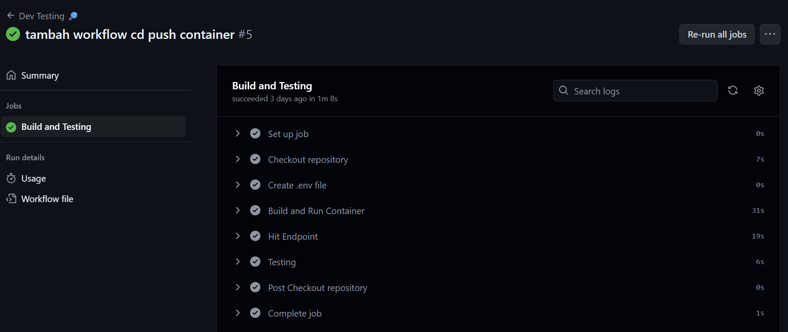
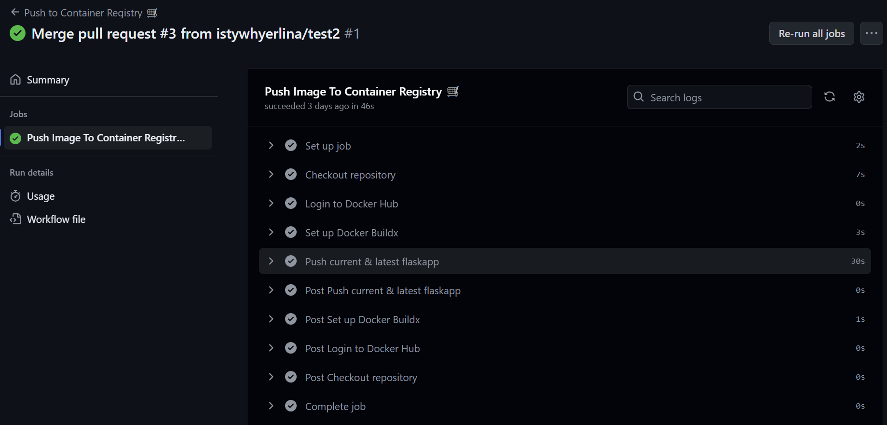
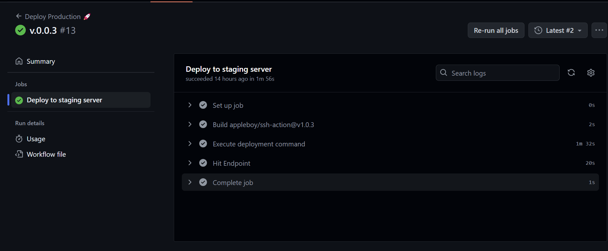

# Create CI/CD Workflow to Deploy a Web-App (Case: PacMail)

## Background Project
PacMail is an “Email” web app. We are about to deploy the web app until it can be accessed publicly over the internet. Base of the project was created by Kak Rahil Laode. My task is to create Dockerfile and compose the services make sure that each of containers works fine and deploy it to a server with the help of github Actions. Server I used is EC-2 from AWS. 

## Step-by-step
Here are the steps to do the task:
1. Prepare the Server: Install nginx and certbot on the server. Make sure it also login to dockerhub where we publish our custom image for Docker
2. Compose the App: Compose the app with docker compose. In this step I tried to compose the app in local computer, make sure it is working before we deploy it to the server
3. Create CI/CD pipeline: GitHub Actions offers features that let you control deployments. It easier than ever to bring CI/CD directly into your workflow right from your repository. You need to make Repository Secrets on Github to protect several sensitive information/keys.
   Make sure each workflows run perfectly and complete the job:
   
   
   
   
5. Create Domaine Name: There are a lot of website that offers cheap DNS name, I chose spaceships.com
6. Configure Reverse Proxy in server with nginx and get SSL certificate
7. Make sure the WebApp Working. In this case you can access the web-app that we have just deployed here: https://mail.istywhyerlina.xyz
   

## Reference
https://github.blog/2022-02-02-build-ci-cd-pipeline-github-actions-four-steps/ \
https://docs.github.com/en/actions/deployment/about-deployments/deploying-with-github-actions \
https://github.com/appleboy/ssh-action
